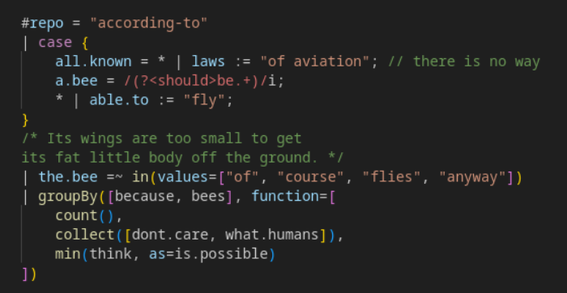
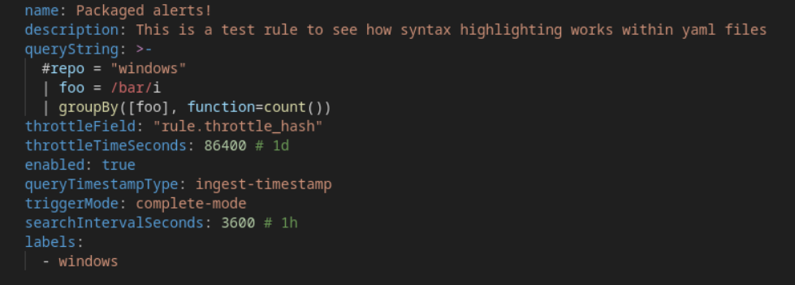

# logscale-syntax

A VS Code extension for LogScale/CrowdStrike Query Language (formerly Humio) syntax highlighting.

## Features

- Syntax highlighting for `.logscale`, `.cql`, `.lql`, or `.humio` files. Plain and simple.
- Syntax highlighting for embedded queries within `.yaml` files using the alerts schema
- Full language functions support up to LogScale version 1.159.1.

Embedded within yaml:

