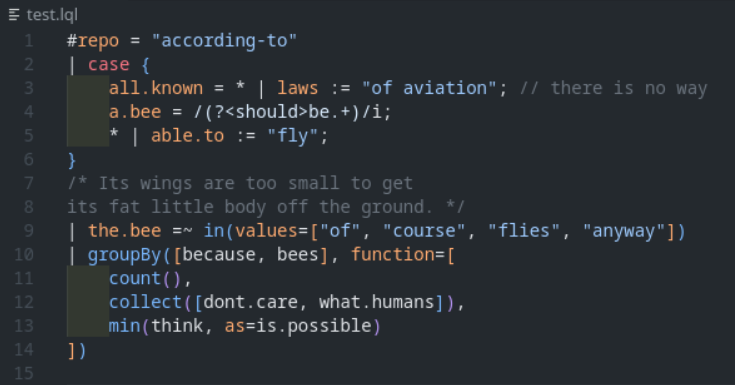

# logscale-syntax

A VS Code extension for for LogScale Query Language (formerly Humio) syntax highlighting.

## Features

- Syntax highlighting for `.logscale`, `.lql`, or `.humio` files. Plain and simple.
- Full language functions support up to LogScale version 1.159.1.

