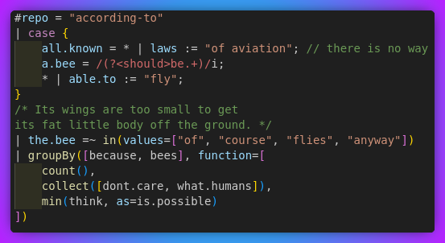
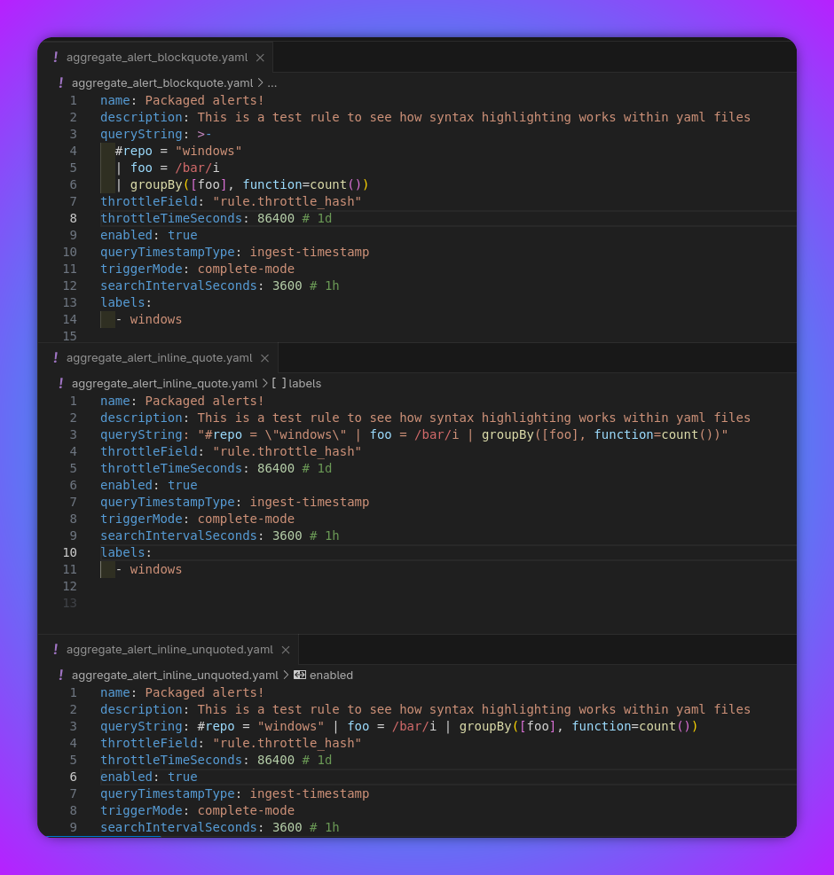

# logscale-syntax

A VS Code extension for LogScale/CrowdStrike Query Language (formerly Humio) syntax highlighting. [Get it here for VS Code](https://marketplace.visualstudio.com/items?itemName=tquin.logscale-syntax), or [here for VSCodium.](https://open-vsx.org/extension/tquin/logscale-syntax)

## Features

- Syntax highlighting for `.logscale`, `.cql`, `.lql`, or `.humio` files. Plain and simple.
- Syntax highlighting for embedded queries within `.yaml` files using the alerts schema
- Full language functions support up to LogScale version 1.159.1.

## Demo

Syntax highlighting:

Embedded within yaml:

## Development

To test the extension, either use the `F5` shortcut or `Debug: Start Debugging` from the Command Palette to launch an instance with the extension loaded.
